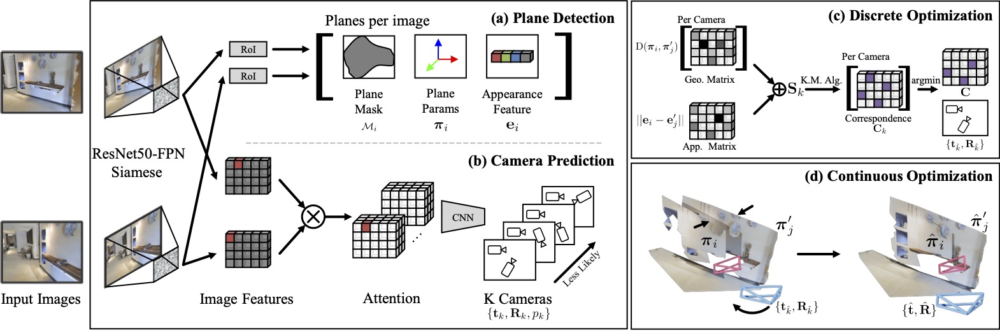

Planar Surface Reconstruction From Sparse Views
================================================================

<h4>
Linyi Jin, Shengyi Qian, Andrew Owens, David F. Fouhey
</br>
<span style="font-size: 14pt; color: #555555">
University of Michigan
</span>
</h4>
<hr>

**arXiv** [arxiv.org/abs/2103.14644][1]

Given two RGB images with an unknown relationship, our system produces a single, coherent planar surface reconstruction of the scene in terms of 3D planes and relative camera poses. 


We use a ResNet50-FPN to detect planes and predict probabilities of relative camera poses, and use a two-step optimization to generate a coherent planar reconstruction. (a) For each plane, we predict a segmentation mask, plane parameters, and an appearance feature. (b) Concurrently, we pass image features from the detection backbone through the attention layer and predict the camera transformation between views. (c) Our discrete optimization fuses the prediction of the separate heads to select the best camera pose and plane correspondence. (d) Finally, we use continuous optimization to update the camera and plane parameters.

Citation
--------

If you find this code useful, please consider citing:

```text
@inproceedings{jin2021planar,
      title={Planar Surface Reconstruction from Sparse Views}, 
      author={Linyi Jin and Shengyi Qian and Andrew Owens and David F. Fouhey},
      year={2021},
      eprint={2103.14644},
      archivePrefix={arXiv},
      primaryClass={cs.CV}
}
```

[1]: http://arxiv.org/abs/2103.14644